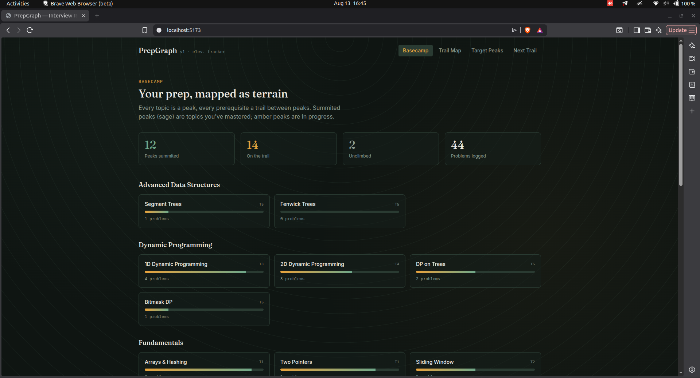
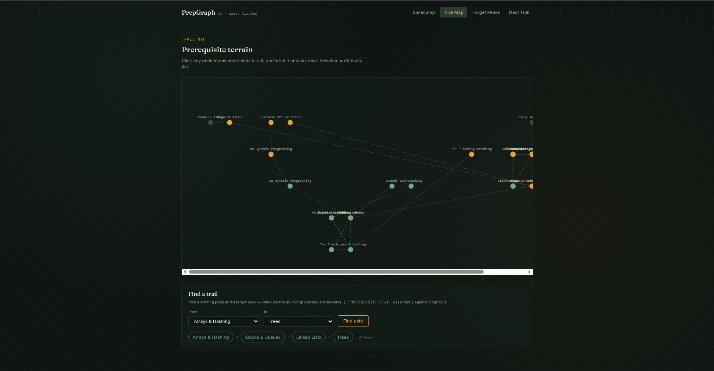
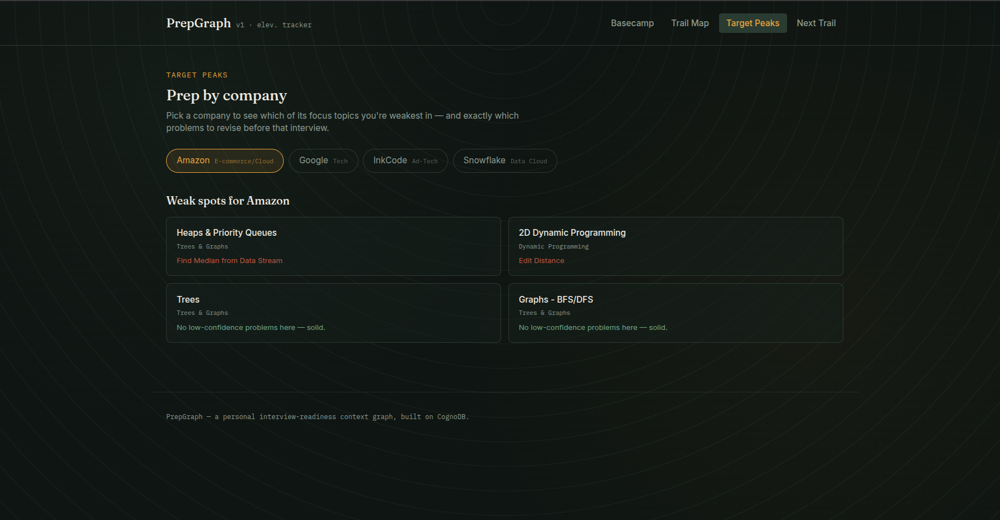
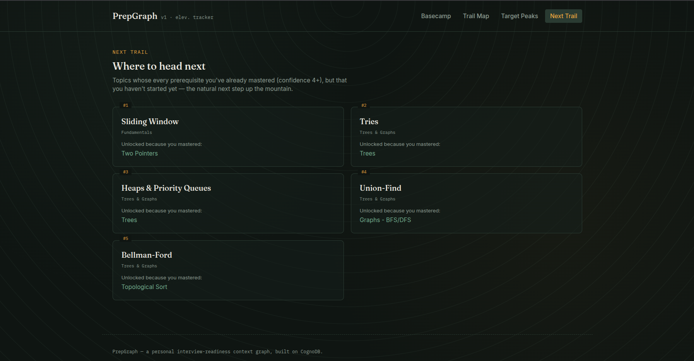

# PrepGraph — an interview-readiness context graph

Built for the Wexa AI CognoDB take-home assignment.

## The use case

PrepGraph turns a personal DSA/interview-prep tracker into a queryable graph. Instead of a flat
spreadsheet of "problem → topic → done/not done", it models the actual *relationships* that matter
during prep: which topics unlock which others, which patterns quietly connect problems that look
unrelated on the surface, and which companies' interviews lean on which topics.

The app answers three real questions a candidate actually has mid-prep:

1. **"What do I need to study before I'm ready for Segment Trees?"** — a prerequisite chain.
2. **"I have a Snowflake interview next week — where am I weakest in what they actually ask?"** — a
   company-to-weak-topic-to-specific-problem traversal.
3. **"What should I study next?"** — a recommendation derived purely from the graph shape (every
   prerequisite of a topic is already mastered, but the topic itself isn't).

## Why a graph database?

- **Prerequisite chains need a recursive lookup.** "What comes before X?" means walking a variable
  number of steps. In Cypher that's one pattern: `(start)-[:PREREQUISITE_OF*1..6]->(target)`. In
  SQL I'd need a recursive CTE, and it gets messier the deeper the chain goes.
- **The company/weak-topic query touches three different things at once.** "Which of this
  company's focus topics am I weak in, and which problems should I revise" goes Company → Topic →
  Problem in one connected question. In a relational schema that's a 3-table join plus a HAVING
  clause on an aggregate — doable, but it's the kind of query that gets uglier every time the model
  grows.
- I used relationships for prerequisites and patterns because those are the two things I actually
  want to query across. If I later add something like `CONTRASTS_WITH` between two easily-confused
  patterns, it's one new relationship type — not a new bridge table and a migration.
- The "what should I study next" recommendation is just a pattern match: find a topic where every
  incoming prerequisite is already in my mastered set. That's a single Cypher `MATCH ... WHERE
  ALL(...)` instead of pulling everything into JS and looping over it.

## Data model

**Nodes:** `Topic`, `Pattern`, `Problem`, `Company`, `InterviewSession`

**Relationships:**

| Relationship | Meaning |
|---|---|
| `(Topic)-[:PREREQUISITE_OF]->(Topic)` | Must-learn-before ordering (the core multi-hop edge) |
| `(Problem)-[:BELONGS_TO]->(Topic)` | Which topic a problem tests |
| `(Problem)-[:USES_PATTERN]->(Pattern)` | Which reusable pattern solves it |
| `(Problem)-[:SIMILAR_TO]->(Problem)` | Variant/twin problems |
| `(Company)-[:FOCUSES_ON]->(Topic)` | What a company's interviews emphasize |
| `(InterviewSession)-[:TESTED]->(Topic)` | What actually came up in a real interview |

```
(InterviewSession) --TESTED--> (Topic) --PREREQUISITE_OF--> (Topic)
                                    ^                              |
                                    |                        BELONGS_TO
                               FOCUSES_ON                          |
                                    |                               v
                                (Company)                      (Problem) --USES_PATTERN--> (Pattern)
                                                                     |
                                                                SIMILAR_TO
                                                                     |
                                                                     v
                                                                (Problem)
```

## Project structure

```
prepgraph/
  server/
    src/
      db.js              # Neo4j driver singleton + connectivity check
      app.js              # Express entry point
      routes/              # HTTP layer — thin, delegates to queries/
      queries/             # All Cypher, parameterised, one file per domain
      middleware/errorHandler.js
    seed/
      data.json            # Real seed data (topics, problems, companies...)
      seed.js              # Reset-and-seed — safely rebuilds the demo graph on every run
    .env.example
  client/
    src/
      pages/               # Dashboard, TopicExplorer, CompanyView, NextBest
      components/          # Navbar, TopicGraph (SVG), Loading/Empty/Error states
      api.js                # Fetch wrapper, one function per endpoint
    .env.example
```

## Setup & run instructions

### 1. Create your CognoDB instance

1. Go to `https://console.cognodb.com/signup` and create a free account (no credit card needed).
2. From the console, create a free **c0** instance and pick a region — provisions in under a minute.
3. Copy the connection URI (`bolt+s://<instance-id>.databases.cognodb.cloud`) and the generated
   password for user `cognodb`. **The password is shown once** — save it immediately.

### 2. Backend

```bash
cd server
cp .env.example .env      # fill in COGNODB_URI / COGNODB_USER / COGNODB_PASSWORD
npm install
npm run seed               # loads topics, problems, companies etc. into CognoDB
npm run dev                 # starts the API on http://localhost:4000
```

### 3. Frontend

```bash
cd client
cp .env.example .env       # points at the backend API
npm install
npm run dev                 # starts the app on http://localhost:5173
```

### 4. Verify

Visit `http://localhost:4000/api/health` — should return `{"status":"ok"}`. If it returns
`db_unreachable`, double-check your `.env` values and that the CognoDB instance is running.

## Main queries, explained

All queries live in `server/src/queries/` and are run only through the official `neo4j-driver`
with named parameters (`$topicName`, `$companyName`, etc.) — never string concatenation.

- **`prerequisitePath`** (multi-hop, 2+ hops) — shortest path between any two topics using
  `[:PREREQUISITE_OF*1..6]`. Exposed directly in the UI as a "Find a trail" picker on the Trail Map
  page (pick a From/To topic, see the exact hop-by-hop path) — this is the clearest place to point
  to when explaining the multi-hop requirement.
- **`weakTopicsForCompany`** (the SQL-awkward one) — for a chosen company, finds its focus topics
  and, within those, the specific problems you're weak in. Crosses Company → Topic → Problem with
  an aggregate filter in one pattern.
- **`nextBestTopics`** — recommends unlocked-but-unstarted topics using `ALL(...)` over each
  candidate's prerequisite set.
- **`similarByPattern`** — surfaces problems connected through a shared `Pattern` node, even when
  their topics differ — the kind of connection that's easy to surface in a graph but would need
  extra work to find in a relational schema.

## Engineering notes

- Connection details are read from environment variables only; `.env` is gitignored on both sides.
- Every route wraps its query call in try/catch and forwards errors to a central error handler,
  which distinguishes "database unreachable" (503, with a clear message) from a generic bug (500).
- The UI has explicit loading, empty, and error states on every page — no blank screens.
- Entity and relationship creation uses `MERGE` where an entity could plausibly already exist;
  the seed script starts by resetting the graph (`DETACH DELETE`) so the included dataset rebuilds
  deterministically on every run, and `InterviewSession` logs are safely `CREATE`d since the reset
  already guarantees no duplicates.

## Implementation notes

I kept this intentionally small rather than trying to cover everything.

The backend is a plain Express API. Cypher queries live in their own files under
`src/queries/`, separate from the route handlers — mostly so I can copy a query straight into the
CognoDB console and test it on its own when something isn't returning what I expect. The frontend
only ever talks to this API, never to CognoDB directly.

The seed script wipes the graph and rebuilds it from `data.json` on every run. That means the demo
data is always reproducible from a clean database, which felt more useful for this assignment than
a script that has to guess what already exists.

For the Trail Map page I built a small custom SVG layout instead of pulling in a force-graph
library. The dataset is small (under 30 topics) and the only thing that actually needs to render is
the prerequisite ordering, so a dependency felt like more than the problem needed.

## Known limitations / possible enhancements

- `InterviewSession` nodes and the `TESTED` relationship are modeled and seeded, but not yet
  surfaced in a dedicated UI view. A natural next step: an "Interview History" page listing past
  sessions with a query like *"which topics repeatedly appear across interviews, and where am I
  weakest in those" — a good example of the kind of question this graph model is built for.
  Left it out for now to keep the shipped surface area solid rather than rushing in a half-built
  feature.
- The pattern-similarity view (`/problems/:title`) is intentionally minimal — it demonstrates the
  relationship-discovery query without trying to be a full problem-tracking UI.

## Screenshots

### Dashboard



### Trail Map



### Company View



### Next Trail




## Demo & recording

*(Add hosted demo link and screen recording link here — both mandatory per the assignment.)*
